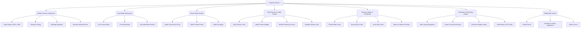

# Trickle AI - Mind Map

```mermaid
graph TD
    A[Trickle AI Phase 2] --> B(Infinite Canvas Architecture)
    A --> C(Dual-Mode Workspace)
    A --> D(Smart Node System)
    A --> E(Daily Planner & Habit Tracker)
    A --> F(Memory Maker & Scrapbook)
    A --> G(Flowchart & Mind Map Engine)
    A --> H(Multimedia Library)

    B --> B1[Virtual Space 100k x 100k]
    B --> B2[Viewport Culling]
    B --> B3[Minimap Navigator]
    B --> B4[Named Sections/Zones]

    C --> C1[Life Canvas Mode]
    C --> C2[Flow Map Mode]
    C --> C3[Animated Mode Switch]

    D --> D1[Node Connection Points]
    D --> D2[Node Content Panel]
    D --> D3[Node Grouping]

    E --> E1[Daily Planner Card]
    E --> E2[Habit Tracker Widget]
    E --> E3[Weekly Planning Canvas]
    E --> E4[Monthly Review Card]

    F --> F1[Photo/Video Cards]
    F --> F2[Journal Entry Card]
    F --> F3[Voice Note Card]
    F --> F4[Meme & Sticker Overlays]

    G --> G1[Auto-Layout Algorithms]
    G --> G2[Smart Connector Routing]
    G --> G3[Flowchart Shape Library]
    G --> G4[Code Block & API Cards]

    H --> H1[Unified Panel]
    H --> H2[Unsplash & Giphy Integration]
    H --> H3[Built-in Icons]
```